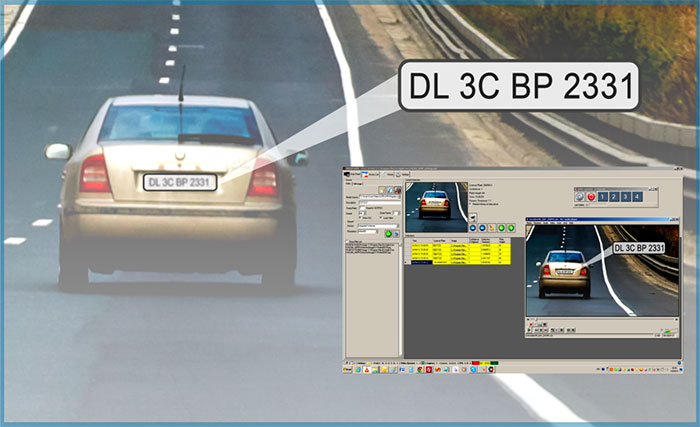
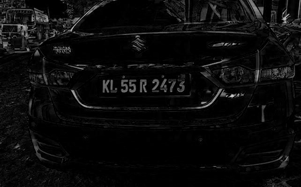
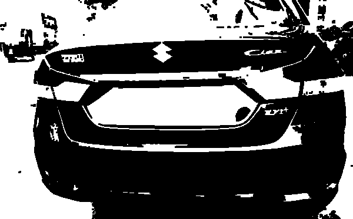
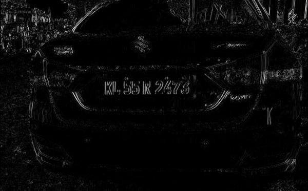
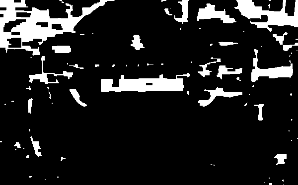
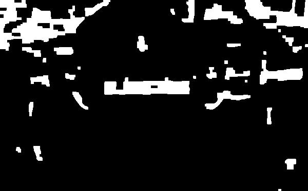
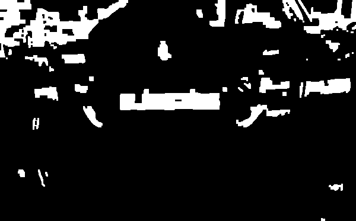
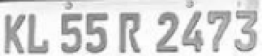
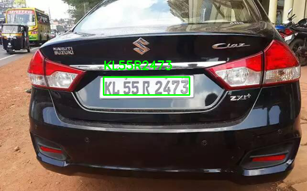

<!--
*** Thanks for checking out the Best-README-Template. If you have a suggestion
*** that would make this better, please fork the repo and create a pull request
*** or simply open an issue with the tag "enhancement".
*** Thanks again! Now go create something AMAZING! :D
-->


<!-- PROJECT SHIELDS -->
<!--
*** I'm using markdown "reference style" links for readability.
*** Reference links are enclosed in brackets [ ] instead of parentheses ( ).
*** See the bottom of this document for the declaration of the reference variables
*** for contributors-url, forks-url, etc. This is an optional, concise syntax you may use.
*** https://www.markdownguide.org/basic-syntax/#reference-style-links
-->
## Auto Number Plate Recognizer
<!--
[![Contributors][contributors-shield]][contributors-url]
[![Forks][forks-shield]][forks-url]
[![Stargazers][stars-shield]][stars-url]
[![Issues][issues-shield]][issues-url]
[![MIT License][license-shield]][license-url]
-->
[![LinkedIn][linkedin-shield]][linkedin-url]


<!-- PROJECT LOGO -->
<!--
<br />
<p align="center">
  <a href="https://github.com/othneildrew/Best-README-Template">
    
  </a>

  <h3 align="center">Best-README-Template</h3>

  <p align="center">
    An awesome README template to jumpstart your projects!
    <br />
    <a href="https://github.com/othneildrew/Best-README-Template"><strong>Explore the docs »</strong></a>
    <br />
    <br />
    <a href="https://github.com/othneildrew/Best-README-Template">View Demo</a>
    ·
    <a href="https://github.com/othneildrew/Best-README-Template/issues">Report Bug</a>
    ·
    <a href="https://github.com/othneildrew/Best-README-Template/issues">Request Feature</a>
  </p>
</p>

-->

<!-- TABLE OF CONTENTS -->
<details open="open">
  <summary>Table of Contents</summary>
  <ol>
    <li>
      <a href="#about-the-project">About The Project</a>
      <ul>
        <li><a href="#built-with">Built With</a></li>
      </ul>
    </li>
    <li>
      <a href="#getting-started">Getting Started</a>
      <ul>
        <li><a href="#prerequisites">Prerequisites</a></li>
        <li><a href="#installation">Installation</a></li>
      </ul>
    </li>
    <li><a href="#run">Run</a></li>
    <li><a href="#contact">Contact</a></li>
    <!--
    <li><a href="#roadmap">Roadmap</a></li>
    <li><a href="#contributing">Contributing</a></li>
    <li><a href="#license">License</a></li>
    <li><a href="#acknowledgements">Acknowledgements</a></li>
    -->
  </ol>
</details>


<!-- ABOUT THE PROJECT -->
## About The Project

<!-- [![Product Name Screen Shot][product-screenshot]](https://example.com) -->


Auto Number Plate Recognition (ANPR) is a computer vision task that uses Optical Character Recognition (OCR) and other image segmentation and detection methods to read the car number plate. In this project, we successfully locate the plate in the frame and recognize the characters using Optical Character Recognition. Also, draw the bounding box on the license plate and put the recognized license number above the bounding box.

<!-- ## Motivation -->

## Techinical Aspect


<b>Devide this project into two parts-</b>
<b>1. Plate detection</b>
<b>2. Plate recognition</b>

<b>In the Plate detection phase, perform image processing filters which are given below.</b>
* <b>Perform a blackhat (It reveal bright region of an image on dark background) morphological operation on the grayscale (Grayscale images are single channel images with pixel values in the range of [0, 255]) image. Output of this phase is given blow-</b>


* <b>Find the light region in the processed image using Morphology and Thresholding. The output will look like below image.</b><br><br>

<br>
* <b>Compute the Scharr gradient representation of the blackhat image in the x-direction and then scale the result back to the range [0, 255].</b><br><br>
<br>
* <b>Apply GaussianBlur to blur the gradient representation, apply closing operation and using otsu's method threshold it.</b><br><br>
<br>
* <b>For cleaning the thresholded image apply erosion and dialation filters.</b><br><br>
<br>
* <b>apply bitwise AND operation between the threshold result and the light regions of the image.</b><br><br>
<br><br>

 <b>After perform all above filters on the image, find contours in the thresholded image and sort them by their size in descending order, keeping only the largest ones.</b><br><br>
 <br><br>
 <br><br>

<b>Now, in the Plate recognition phase, we send the output of the plate detection phase in the OCR (Optical Character Recognition), which recognizes the character of the Number Plate and displays the result.</b><br><br>
<br><br>
<!--
### Built With

This section should list any major frameworks that you built your project using. Leave any add-ons/plugins for the acknowledgements section. Here are a few examples.
* [Bootstrap](https://getbootstrap.com)
* [JQuery](https://jquery.com)
* [Laravel](https://laravel.com)

-->

<!-- GETTING STARTED -->
## Getting Started

Auto number plate recognition is a computer vision project. For running this project, install the required packages and libraries. Installing such stuff follows the steps.

### Prerequisites

Make sure you have installed all of the following prerequisites on your development machine.
* Python 3.6
* Opencv 4.5.1
* Numpy
* Tesseract-ocr

<!--
* npm
  ```sh
  npm install npm@latest -g
  ```
-->

### Installation

* The Code is written in Python 3.6. For running this project locally on your machine, first, make a virtual environment; you can follow steps to create a virtual environment [here](https://docs.python.org/3/tutorial/venv.html). To install the required packages and libraries, run this command in the project directory after cloning the repository:
* Clone the repo
   ```sh
   git clone https://github.com/ermp8888/Auto-Number-Plate-Recognize.git
   ```
* Run the Command to install packages
   ```sh
   pip install -r requirements.txt
   ```
* To install the Tesseract-ocr follow this [page](https://github.com/UB-Mannheim/tesseract/wiki)
   
   
<!-- USAGE EXAMPLES -->
## Run

After creating a virtual environment and install all required packages and libraries, run license_plate_with_ocr.py file to run the project.


<!-- ROADMAP -->
<!--
## Roadmap

See the [open issues](https://github.com/othneildrew/Best-README-Template/issues) for a list of proposed features (and known issues).


## Contributing

Contributions are what make the open source community such an amazing place to be learn, inspire, and create. Any contributions you make are **greatly appreciated**.

1. Fork the Project
2. Create your Feature Branch (`git checkout -b feature/AmazingFeature`)
3. Commit your Changes (`git commit -m 'Add some AmazingFeature'`)
4. Push to the Branch (`git push origin feature/AmazingFeature`)
5. Open a Pull Request


## License

Distributed under the MIT License. See `LICENSE` for more information.
-->


<!-- CONTACT -->
## Contact

Mohd Parvez - [@mohdparvez94](https://twitter.com/mohdparvez94?s=08) - mohdparvez94@gmail.com

Project Link: [https://github.com/ermp8888/Auto-Number-Plate-Recognize.git](https://github.com/ermp8888/Auto-Number-Plate-Recognize.git)


<!-- ACKNOWLEDGEMENTS -->
<!--
## Acknowledgements
* [GitHub Emoji Cheat Sheet](https://www.webpagefx.com/tools/emoji-cheat-sheet)
* [Img Shields](https://shields.io)
* [Choose an Open Source License](https://choosealicense.com)
* [GitHub Pages](https://pages.github.com)
* [Animate.css](https://daneden.github.io/animate.css)
* [Loaders.css](https://connoratherton.com/loaders)
* [Slick Carousel](https://kenwheeler.github.io/slick)
* [Smooth Scroll](https://github.com/cferdinandi/smooth-scroll)
* [Sticky Kit](http://leafo.net/sticky-kit)
* [JVectorMap](http://jvectormap.com)
* [Font Awesome](https://fontawesome.com)
-->


<!-- MARKDOWN LINKS & IMAGES -->
<!-- https://www.markdownguide.org/basic-syntax/#reference-style-links -->
[contributors-shield]: https://img.shields.io/github/contributors/othneildrew/Best-README-Template.svg?style=for-the-badge
[contributors-url]: https://github.com/othneildrew/Best-README-Template/graphs/contributors
[forks-shield]: https://img.shields.io/github/forks/othneildrew/Best-README-Template.svg?style=for-the-badge
[forks-url]: https://github.com/othneildrew/Best-README-Template/network/members
[stars-shield]: https://img.shields.io/github/stars/othneildrew/Best-README-Template.svg?style=for-the-badge
[stars-url]: https://github.com/othneildrew/Best-README-Template/stargazers
[issues-shield]: https://img.shields.io/github/issues/othneildrew/Best-README-Template.svg?style=for-the-badge
[issues-url]: https://github.com/othneildrew/Best-README-Template/issues
[license-shield]: https://img.shields.io/github/license/othneildrew/Best-README-Template.svg?style=for-the-badge
[license-url]: https://github.com/othneildrew/Best-README-Template/blob/master/LICENSE.txt
[linkedin-shield]: https://img.shields.io/badge/-LinkedIn-black.svg?style=for-the-badge&logo=linkedin&colorB=555
[linkedin-url]: https://linkedin.com/in/othneildrew
[product-screenshot]: images/screenshot.png
